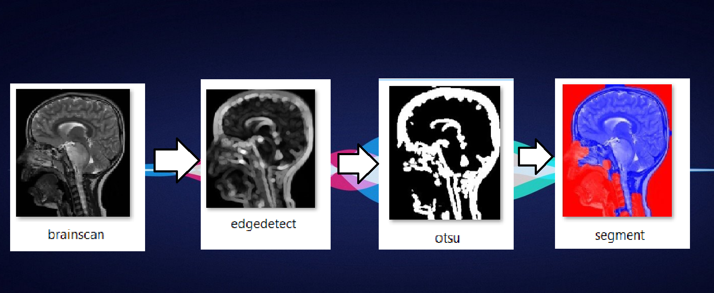

# ComputerVisionBased_ImageSegmentation
Medical Image Segmentation Using Computer Vision &amp; Image Processing

# Library Installations:
 
- run: 
- pip install cv2
- pip install matplotlib
- pip install numpy

# Usuage

If you like this work please help me by giving me some stars.
